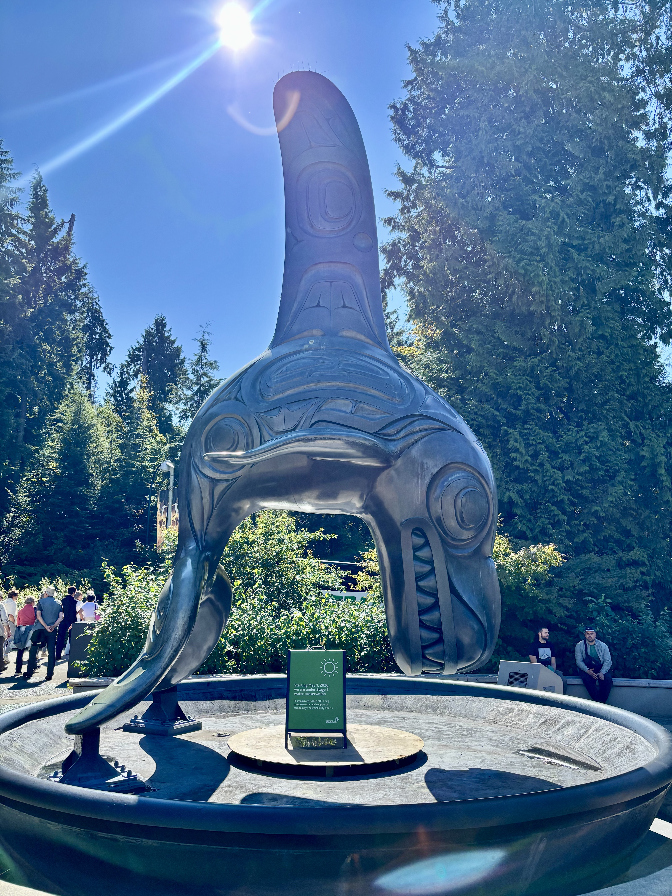

{width=250px fig-align="center"}

# Hi, I'm Shravan.

I spent five years teaching machines to find anomalies, recognize things, and understand language.

Then I decided to move halfway across the world and teach *myself* some new things instead.

I'm currently pursuing a **Master of Data Science at UBC**, after five years as a Senior ML Engineer at Bosch, where I worked on anomaly detection, computer vision, and NLP.

So far, the transition has involved data science, new friends, questionable amounts of coffee, and discovering that Vancouver has beaches.

## Currently

📍 **Living:** Vancouver, Canada  
🎓 **Studying:** Master of Data Science at UBC  
💻 **Learning:** New tools, techniques, and ways of thinking about data  
🎸 **Learning badly:** Guitar  
🍜 **Exploring:** Vancouver's food scene  
🏖️ **Looking for:** Beaches whenever the weather cooperates

The first two are going reasonably well. The third is under investigation.

## From the blog

I use the blog to document some of the things I get up to — particularly during my MDS year.

- **My First Week in MDS** — flights, beaches, orientation, and a birthday across time zones.
- **A Perfect Day in Vancouver** — one very good day exploring the city.

[About me](about.qmd)

[Read the blog](blog.qmd)