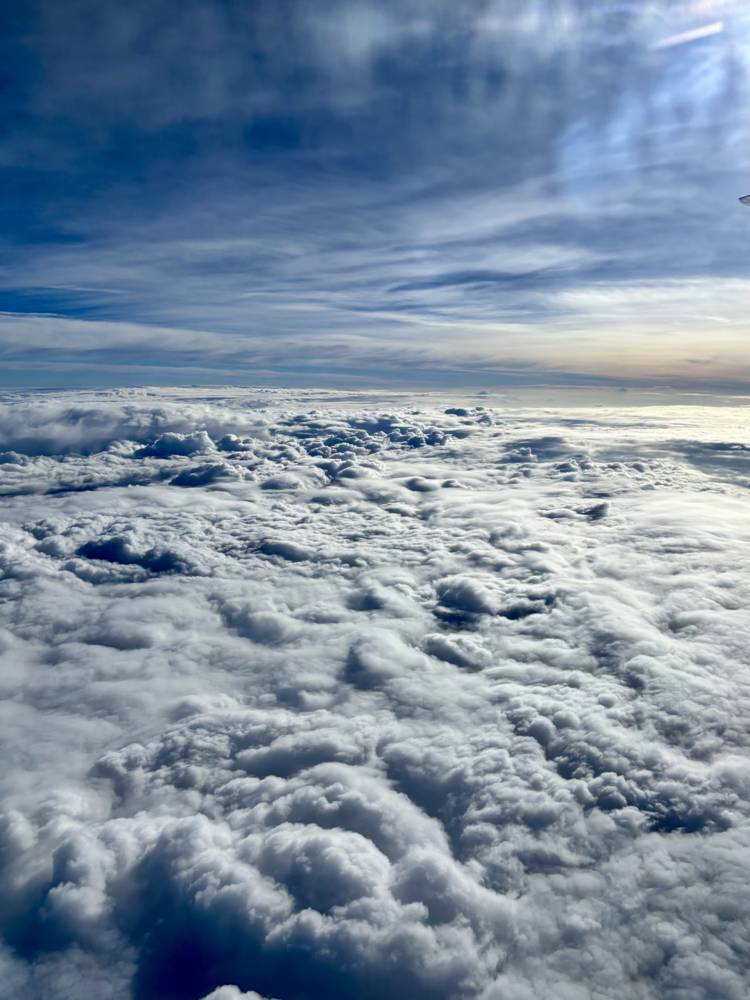
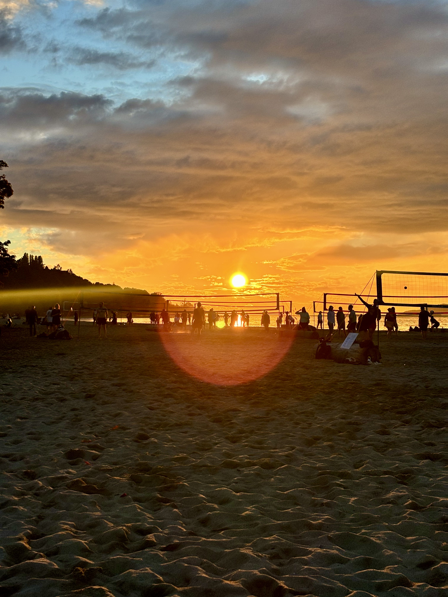

My first week in MDS was quite interesting.

I had been preparing for this move for months. Then, quite suddenly, I was sitting on a plane at 3 in the morning wondering how exactly I had agreed to do this.

## The Flight

{width=400px fig-align="center"}

I started my flight from India at 3 in the morning.

Twenty hours of travelling, a 4-hour layover in Frankfurt, and several attempts at sleeping later, I landed in Vancouver.

It was 3 in the afternoon.

Apparently, when you cross enough time zones, your birthday starts behaving like a distributed system.

::: {.callout-note}
**Longest birthday ever:** Landing day happened to be my birthday. Crossing that many time zones gave me the longest birthday of my life.

At this point, I had been awake for approximately 47 years, although the exact number is still pending validation.
:::

The slightly strange part was that despite leaving India at 3 AM and travelling for most of the day, Vancouver greeted me with another 3 PM.

My body, meanwhile, had stopped participating in the experiment.

## Jericho Beach

I stayed in a hostel near Jericho Beach for the first week.

This turned out to be an excellent decision.

I'm a big fan of beaches, so about ten minutes after checking in, I headed out to see it for myself.

I ended up standing there for a while, watching the waves wash over my feet with the evening sun coming down.

{width=400px fig-align="center"}

After spending roughly a day travelling halfway across the world, it was probably the first moment when it actually felt like:

**Okay. I'm here.**

And then I remembered I had to figure out where I was going to buy groceries.

## Orientation

The next day, I attended the MDS Orientation.

After travelling from India, waking up in a new country, and spending the previous day contemplating the meaning of time, suddenly being surrounded by a room full of people who were all about to spend the next year doing the same program was a little surreal.

I met a lot of new people, and one of the things I enjoyed most was hearing everyone's stories — where they came from, what they had been doing before MDS, and what brought them here.

There was a surprisingly large amount of interesting life experience packed into one cohort.

I'm looking forward to getting to know everyone better over the next year.

::: {.callout-tip}
**Data Science lesson #1:** Meeting an entire cohort at once produces a rather impressive amount of unstructured data.
:::

{width=400px fig-align="center"}

## So far

One week in, and the experiment has started.

I've moved to a new country, started a new degree, met a lot of new people, found a beach within ten minutes of my hostel, and somehow managed to have a birthday that lasted significantly longer than intended.

Not a bad first week.

Now I just have to survive the rest of the program.

And Vancouver winter.

Those are two separate problems.