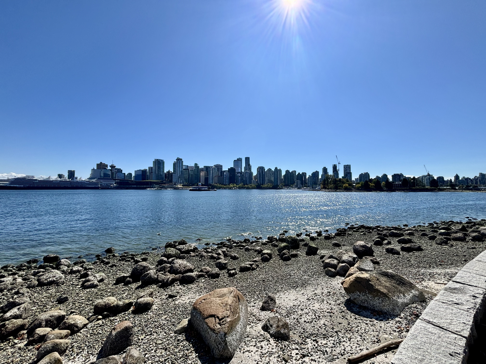
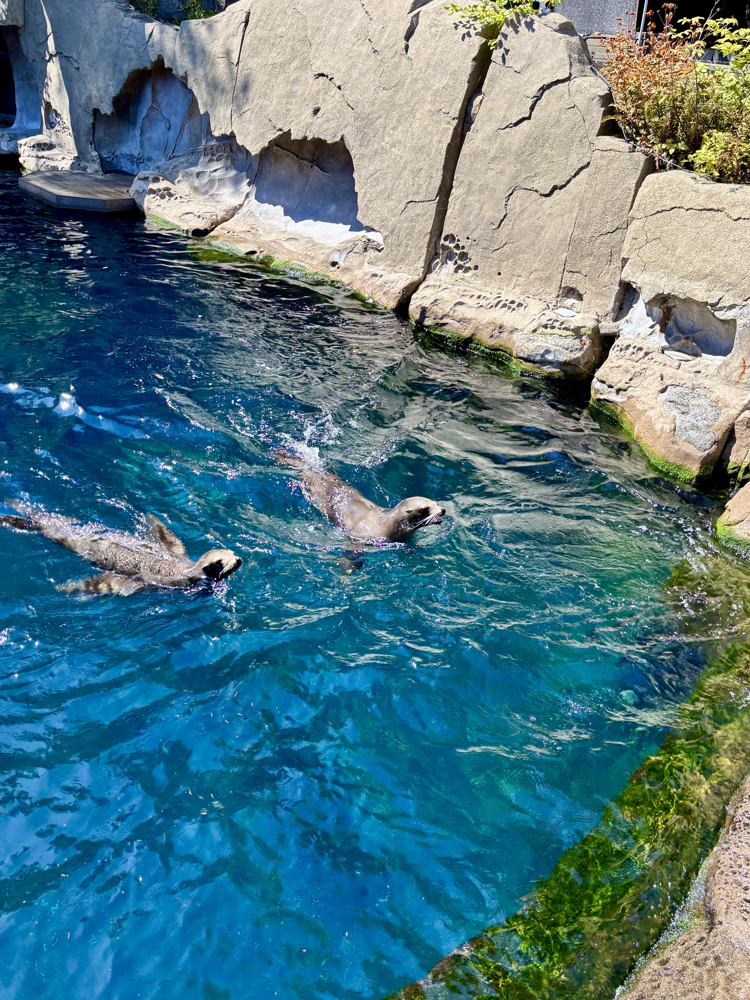
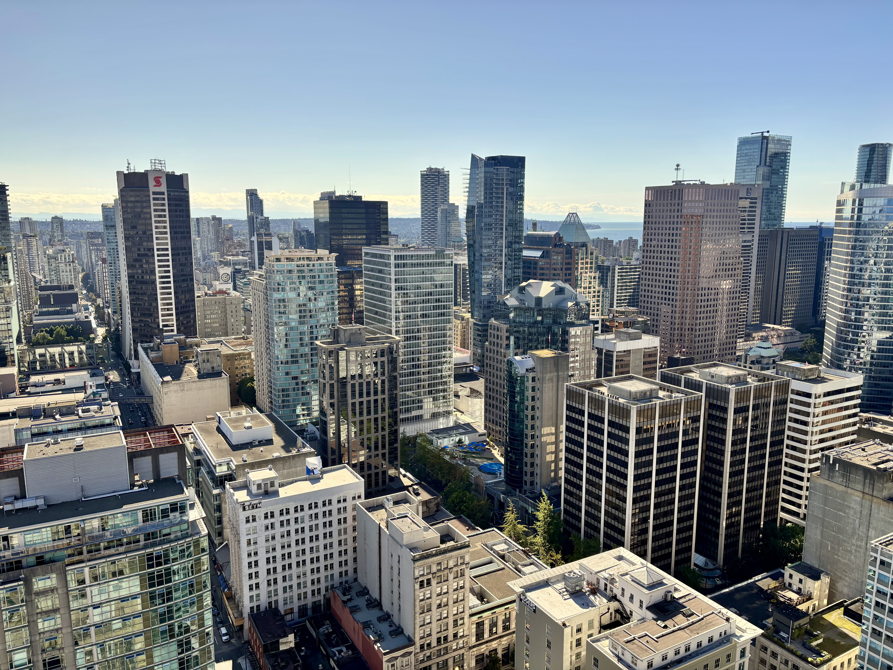

I'd only been in Vancouver for a couple of weeks, so I decided to conduct a fairly ambitious experiment: how much of the city could I see in a single day?

The answer turned out to be quite a lot — although my feet had a different opinion by the end.

I somehow managed to fit a forest, an ocean, a skyline, and a pint of beer into one day, all before sunset.

## Stanley Park

First stop: Stanley Park.

I'd heard it was big, but walking into it still caught me off guard — massive trees on one side, the ocean on the other, and a seawall that just keeps going.

I spent the morning wandering the trails, half expecting to see a bear. I didn't — thankfully, or unfortunately, depending on how brave I was feeling that day.

::: {.callout-tip}
If you're doing this in one day like I did, start at Stanley Park early. It's very easy to lose track of time here.
:::

{width=400px fig-align="center"}

One of the things I liked most was how quickly the scenery changed. One minute I was surrounded by trees, and the next I was looking out over the water with downtown in the distance.

Having only recently moved here, it was one of those moments where Vancouver started to feel a little less like a place I'd moved to and a little more like a place I was beginning to know.

## Vancouver Aquarium

From the park, it was a short walk to the Vancouver Aquarium.

The sea otters were doing their absolute best to steal the show, and, frankly, they had no competition. I probably spent twenty minutes just watching them float around.

They appeared to have mastered the art of having absolutely nowhere else to be.

It's a good reminder of how much marine life is sitting right off the coast here.

{width=400px fig-align="center"}

## Vancouver Lookout

By the afternoon, I made my way downtown to the Vancouver Lookout for a completely different perspective — literally.

Seeing the whole city laid out from up there, with the mountains in the background and the water on every side, made it click just how much Vancouver is shaped by its geography.

After seeing the city from ground level all morning, it was nice to finally see what all the walking had added up to.

Worth the elevator ride up.

{width=400px fig-align="center"}

## Gastown

By this point, I had walked enough that my feet had started submitting complaints.

So I ended the day exactly the way you're supposed to end a good day of exploring: a beer in Gastown.

Cobblestone streets, the steam clock doing its thing, and a cold drink after a full day of walking — a solid way to close out my first real tour of the city.

::: {style="text-align: center;"}

:::

---

Four stops, one day, and I think I understand Vancouver a little better now.

I'm still very new to the city, but one thing I've already noticed is how easy it is to go from forest to ocean to skyline to historic neighbourhood without really feeling like you've left the city at all.

There are still plenty of places I haven't seen, which is probably a good thing.

My feet may disagree, but I think I'm going to like it here.